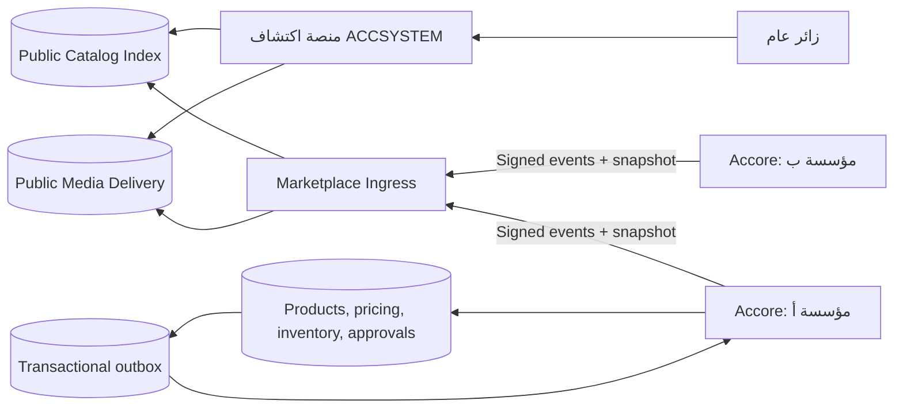

# منصة المنتجات والعروض المؤسسية — تصميم شلالي وعقود التكامل

**الحالة:** مسودة قرار معماري — لا يبدأ التنفيذ قبل الاعتماد.
**المستودع المالك للتشغيل المؤسسي:** `Emran025/accore-erp`.
**المستودع المالك للسطح العام متعدد المؤسسات:** `Emran025/accsystem_operational`.
**نسخة العقد المقترحة:** `marketplace_contract@1.0`.

> **القرار المركزي المقترح:** يبقى **Accore** المصدر التشغيلي الوحيد للمنتج، المخزون، السعر التجاري، أهلية البيع، والقبول التجاري داخل كل مؤسسة. أما **accsystem_operational** فيكون سطح الاكتشاف العام والفهرس المنشور والعروض والوسائط المصرح بعرضها. لا يجوز استعمال `ProductSite` ككتالوج منتجات؛ فهو سجل تعريفي لمواقع المنتجات البرمجية في النظام البيئي فقط.[1]

## 1. الغرض والحدود

الغرض هو تمكين كل مؤسسة تستخدم Accore من نشر كتالوج منتجاتها وعروضها المعتمدة إلى منصة عامة موحدة؛ بحيث يستطيع الزائر استكشاف التجار والمنتجات والعروض دون كشف بيانات ERP الداخلية أو ربط المنصة العامة مباشرة بقواعد بيانات المؤسسات. يجب أن تدعم التجربة العربية والإنجليزية، وأن تبقى صحة المخزون والسعر والقبول التجاري بيد المؤسسة المالكة للمنتج.

لا يشمل الإصدار الأول دفع المستهلك، تسوية المدفوعات، إدارة السلة العابرة للتجار، أو تنفيذ الشحن. يقتصر الإصدار الأول على **الاكتشاف، التصفح، طلب الاهتمام أو فتح قناة الشراء لدى التاجر، وإظهار العروض السارية**. هذه الحدود ضرورية حتى لا تتحول منصة المحتوى العامة إلى نظام مالي أو مخزني موازٍ.

| المسؤولية | Accore | accsystem_operational |
|---|---|---|
| تعريف المنتج ووحداته وفئته | مالك وحيد | نسخة عرض محدودة فقط |
| التسعير والمخزون وأهلية البيع | مالك وحيد | لا يحتفظ بالتكلفة أو المخزون الدقيق |
| التاجر/المؤسسة والتحقق من حالة النشر | مالك المؤسسة ومصدر الإثبات | سجل عام للمعلومات المصرح بنشرها |
| الصورة ووصف الواجهة والوسوم | اعتماد المؤسسة في Accore | حفظ/تسليم النسخة العامة بعد التحقق |
| العروض والجداول الزمنية | إنشاؤها واعتمادها في Accore | فهرستها وإظهارها عندما تكون منشورة وصالحة |
| البحث والتصفية والصفحات العامة | يزوّد البيانات والأحداث | مالك التجربة العامة والفهرس والـ SEO |
| الطلب أو التحويل إلى الشراء | يستقبل الاستفسار/الطلب لاحقاً | يوجه إلى رابط التاجر أو ينشئ طلب اهتمام موقّع |

## 2. البدائل المعمارية المطلوب الاختيار بينها

| النهج | الوصف | المقابل التشغيلي | الكلفة | تعقيد الإعداد |
|---|---|---|---|---|
| **A. قراءة مباشرة من كل خادم Accore** | تستدعي المنصة العامة خادم كل مؤسسة عند فتح كل صفحة منتج أو عند البحث. | أبسط في التزامن، لكنه يجعل تجربة العامة رهينة اتصال كل مؤسسة ويجعل البحث الموحد بطيئاً وصعب الفهرسة. | منخفضة في التخزين؛ أعلى في عدد الطلبات والدعم. | متوسط. |
| **B. فهرس عام مادي مع أحداث تحديث** | ينشر Accore لقطة آمنة من المنتج/العرض إلى منصة مركزية، وتخدم الأخيرة البحث والصفحات العامة من فهرسها. | فصل واضح بين التشغيل والظهور العام، سرعة بحث، تحمل لانقطاع مؤسسة، وسجل نشر قابل للمراجعة. يحتاج طابور أحداث وإعادة مصالحة. | تخزين وفهرسة إضافيان محدودان. | أعلى في البداية، وأفضل للنمو. |

> **نقطة اعتماد A-01:** هذه الوثيقة تفصل العقد على أساس النهج **B** لأنه يفي بالكتالوج الموحد والـ SEO والتصفح العام. إذا اختير النهج A، تلغى أحداث النسخ ويعاد تصميم البحث والحدود الزمنية؛ ولا ينبغي المزج بين النهجين بلا قرار صريح.

## 3. تجربة المنصة العامة

### 3.1 مسارات الزائر

| المرحلة | الصفحة/السلوك | البيانات الظاهرة | الإجراء التالي |
|---|---|---|---|
| بوابة الاكتشاف | `/marketplace` | فئات بارزة، تجار موثوقون، عروض نشطة، بحث موحد | بحث نصي أو دخول فئة أو تاجر |
| نتائج المنتجات | `/marketplace/products` | بطاقات منتجات مع صورة غلاف، اسم محلي، سعر ظاهر، شارة عرض، اسم التاجر، التوفر العام | تصفية ثم فتح المنتج |
| صفحة التاجر | `/marketplace/merchants/{merchant_slug}` | هوية التاجر، وصف مختصر، الفئات، كتالوجه، العروض النشطة وسياسات الاتصال | فتح منتج أو قناة تواصل |
| صفحة المنتج | `/marketplace/products/{public_product_slug}` | معرض صور، الاسم والوصف، الفئة، السعر/العملة، الوحدة، العرض المؤهل، التاجر، حالة التوفر، CTA | فتح العرض أو طلب اهتمام/زيارة رابط التاجر |
| صفحة العرض | `/marketplace/offers/{offer_slug}` | صورة الحملة، قاعدة الأهلية المبسطة، ما يشمله العرض، السعر قبل/بعد أو نسبة الخصم، نافذة السريان | فتح المنتج أو CTA التاجر |
| طلب الاهتمام | نافذة/صفحة مؤمنة | الاسم ووسيلة الاتصال والمنتج/العرض المختار وموافقة الخصوصية | إنشاء مرجع طلب وإرساله إلى Accore في مرحلة لاحقة |

التجربة المميزة لا تعني كشف تعقيد ERP للزائر. تعرض البطاقة **سعراً عاماً مع العملة، شارة توافر مفهومة، وتاجر واضح**؛ بينما لا تعرض التكلفة أو الهامش أو الرقم الدقيق للمخزون أو مفاتيح المؤسسة. إن تم اختيار إضافة الشراء لاحقاً، يجب أن ينتقل الزائر إلى تدفق تجاري مستقل بعقد `checkout_contract` جديد؛ ولا يضاف كامتداد صامت لعقد الكتالوج.

### 3.2 قواعد العرض العام

1. المنتج لا يظهر إلا إذا كان التاجر `verified`، والمنتج `published` و`public_visibility=listed` و`sellable=true`، وله سعر صالح بعملة معلنة وصورة غلاف `ready` أو بديل مرئي معتمد.
2. العرض لا يظهر إلا إذا كان `published`، ونافذة صلاحيته مفتوحة، والمنتج/التاجر ما زالا قابلين للنشر.
3. عند تغير سعر أو نفاد مخزون، تتغير البطاقة إلى `unavailable` أو تخفى خلال حد التزامن المعتمد؛ لا يعرض المخزون العددي إلا بقرار منفصل.
4. `featured` و`ranking_score` لا يُعطيان أولوية يدوية خفية؛ يلزم سبب تدقيق مثل حملة معتمدة أو جودة اكتمال أو أداء مثبت.
5. كل مسار عام يعرض `data_freshness_at` و`catalog_revision` داخلياً للتشخيص، ولا يلزم عرضه للزائر.

## 4. نموذج النطاق والملكية



| الكيان | المعرّف العام | المالك | وصفه |
|---|---|---|---|
| `MerchantProfile` | `merchant_id` UUID و`merchant_slug` | Accore ثم نسخة عامة | تمثيل المؤسسة البائع؛ لا يساوي `supplier` ولا `customer` تلقائياً. |
| `CatalogPublication` | `publication_id` UUID | Accore | قرار منشور يربط منتج ERP بنطاق الظهور العام. |
| `PublicProduct` | `public_product_id` UUID | Accore للبيانات؛ المنصة للفهرس | إسقاط آمن للمنتج دون تكلفة أو رصيد دقيق. |
| `OfferCampaign` | `offer_id` UUID | Accore | حملة/خصم بزمن وحالة اعتماد ونسخة عرض عامة. |
| `OfferTarget` | `offer_target_id` UUID | Accore | ربط العرض بمنتج أو فئة أو مجموعة منتجات. |
| `PublicMediaAsset` | `asset_id` UUID | المنصة المركزية | أصل صورة منشور، بصمة SHA-256 وبدائل عرض ونص بديل محلي. |
| `PublicationEvent` | `event_id` UUID | Accore | حدث غير قابل للتغيير يطلب إنشاء/تحديث/سحب الإسقاط العام. |

### 4.1 حالات النشر

| الكيان | الحالات | الانتقال المسموح |
|---|---|---|
| ملف التاجر | `draft`، `submitted`، `verified`، `suspended`، `retired` | لا ينشر إلا `verified`. |
| نشر المنتج | `draft`، `in_review`، `approved`، `published`، `suspended`، `withdrawn` | `published` فقط يرسل إلى الفهرس العام. |
| العرض | `draft`، `in_review`، `approved`، `scheduled`، `published`، `expired`، `withdrawn`، `rejected` | يمر تلقائياً من `scheduled` إلى `published` عند نافذة البداية، وينتهي عند النهاية. |
| الوسيط | `uploading`، `processing`، `ready`، `rejected`، `archived` | لا يرتبط بنشر عام إلا `ready`. |

تظل سياسة اعتماد العرض والمنتج داخل Accore، لكنها تستفيد من نمط حالات المحتوى والإتاحة الموجود في `accsystem_operational`؛ فذلك المستودع يفصل فعلاً بين إنشاء الوسيط وحالة الجاهزية ويمنع حذف وسيط ما زالت مراجع محتوى تستخدمه.[2]

## 5. سياسة المنتجات والعروض والصور

### 5.1 إسقاط المنتج العام

لا يجوز إعادة استعمال `ProductResource` الحالي بوصفه عقداً عاماً؛ فهو يتضمن حقولاً تشغيلية مثل التكلفة، الهامش، المخزون، وبيانات التدقيق الداخلية.[3] ينشأ DTO مستقل باسم `MarketplaceProductSnapshot` بالحقول التالية:

| المجموعة | حقول مسموحة للنشر |
|---|---|
| الهوية | `public_product_id`، `merchant_id`، `source_product_id` غير ظاهر للزائر، `catalog_code` اختياري، `revision` |
| النص المحلي | `name.{ar,en}`، `short_description.{ar,en}`، `description.{ar,en}`، `search_keywords.{ar,en}` |
| التصنيف | `category_id`، `category_path`، `tags` المعتمدة |
| البيع | `list_price.amount`، `currency`، `unit_label.{ar,en}`، `availability=available|limited|unavailable|preorder` |
| العرض | `active_offer_summary` أو قائمة `eligible_offer_ids` فقط |
| الوسائط | `cover_asset_id`، `gallery_asset_ids[]`، `alt_text.{ar,en}` |
| الروابط | `merchant_public_url`، `purchase_or_inquiry_url` بعد السماح |
| النشر | `visibility`، `published_at`، `data_freshness_at`، `catalog_revision` |

### 5.2 نموذج العرض

العرض ليس حقلاً داخل المنتج، لأن العرض يمكن أن يستهدف أكثر من منتج، يملك نافذة زمنية، وقد يجمع شروطاً لا تصلح للنسخ في كل بطاقة. ينشأ `OfferCampaign` منفصل:

| الحقل | القاعدة |
|---|---|
| `offer_id`, `merchant_id`, `revision` | مفاتيح مستقرة وفريدة. |
| `title`, `summary`, `terms` | محلية بـ `ar` و`en`؛ يرفض النشر عند غياب عنوان لغة الواجهة المستهدفة. |
| `benefit_type` | `percentage` أو `fixed_amount` أو `fixed_price` أو `bundle` أو `gift`. |
| `benefit_value`, `currency` | صالحان للنوع؛ لا ترسل التكلفة أو الحد الأدنى للربح. |
| `starts_at`, `ends_at`, `timezone` | UTC في النقل مع منطقة منشأ موثقة؛ النهاية بعد البداية دائماً. |
| `redemption_scope` | `public_inquiry` في الإصدار الأول؛ لا يعلن `checkout` قبل عقده المنفصل. |
| `targets` | منتج/فئة/مجموعة؛ لا يسمح بقائمة فارغة في العروض التسويقية. |
| `disclosure` | النص القانوني/القيود/الحد الأقصى للعميل إن وجدت. |
| `status` | وفق جدول الحالات أعلاه. |

### 5.3 سياسة الصور والوسائط

1. الصورة الأصلية تحفظ في تخزين المؤسسة أو تخزين مركزي مُدار، لكن الفهرس العام لا يقبل إلا نسخة لها `asset_id`، `sha256`، `mime_type`، أبعاد، ونص بديل محلي.
2. يقبل الإصدار الأول `JPEG` و`PNG` و`WebP` و`AVIF`؛ الحد الأقصى المقترح 20 MiB للرفع و5 MiB للنسخة المنشورة، مع توليد `thumbnail` و`card` و`detail` و`original`.
3. تصنف الصورة إلى `cover` أو `gallery` أو `offer_hero` أو `merchant_logo`. لا ينشر المنتج بلا `cover` أو بديل `placeholder` معتمد.
4. يمنع النقل المركزي لعناوين URL خارجية غير موثقة. إذا استخدم جلب عن بعد، يجب أن يكون من نطاق Accore المسجل، عبر رابط موقع قصير العمر وقائمة سماح ومنع عناوين الشبكات الداخلية.
5. لا تنشر الصورة قبل فحص نوع الملف والمحتوى الخبيث، وتطبيق حد الأبعاد، وإنشاء البصمة، ومراجعة حقوق الاستخدام. تنسجم دورة `processing → ready` مع آلية الوسائط المركزية الحالية، لكن حفظ `/uploads/media` المحلي ليس حلاً إنتاجياً طويل الأجل؛ يلزم تخزين كائنات متوافق مع S3 وCDN قبل الإطلاق العام.[2]
6. تحذف/تسحب الصورة بنشر حدث `media.revoked`؛ تتحول البطاقات إلى أصل بديل ولا تعيد استخدام URL قديم مخبأ.

## 6. موضع التنفيذ في شجرة Accore

المنتج أصلاً جزء من **Supply Chain → Inventory → Products & Inventory**، بينما نشره ككتالوج عام وعروضه وتجاره وظيفة **Commercial**؛ لا ينبغي نقل إدارة المنتج من المخزون ولا إنشاء تطبيق سوق مستقل يكرر قواعده. شجرة التنقل الحالية تضع شاشة المنتجات في `04-supply-chain/inventory/products-inventory/products` وتترك شاشات متجاورة لإدارة الفئات والمخزون، لذلك تبقى تفاصيل المخزون والمنتج في موضعها.[4]

| الطبقة | المسار المقترح | المسؤولية |
|---|---|---|
| نموذج المنتج القائم | `backend/app/Domains/SupplyChain/Inventory/Models/Product.php` | لا يضاف إليه إلا علاقة/مفتاح نشر اختياري؛ يبقى سجل المنتج التشغيلي. |
| نطاق جديد | `backend/app/Domains/Commercial/Marketplace/` | التاجر العام، نشر الكتالوج، العروض، قواعد أهلية النشر، صندوق الصادر، واستقبال الطلبات. |
| النماذج | `.../Marketplace/Models/` | `MerchantProfile`, `CatalogPublication`, `OfferCampaign`, `OfferTarget`, `MarketplaceOutboxEvent`, `MarketplaceSyncReceipt`. |
| الإجراءات | `.../Marketplace/Actions/` | إرسال للمراجعة، اعتماد، نشر، سحب، جدولة عرض، إعادة محاولة نشر، مصالحة، تعطيل تاجر. |
| الخدمات | `.../Marketplace/Services/` | بناء snapshot، توقيع الحدث، قواعد العرض، رفع الوسائط، عميل operational، استهلاك الردود. |
| API Accore | `backend/app/Http/Controllers/Api/V2/Commercial/Marketplace/` و`backend/routes/domains/02-commercial.php` | واجهات إدارة المؤسسة، لا واجهات عامة. |
| UI الإدارة | `frontend/app/02-commercial/marketplace/` | لوحة التاجر، كتالوج منشور، محرر عروض، وسائط، سجل مزامنة. |
| التنقل | `frontend/lib/navigation/commercial.config.ts` | قدرة جديدة `marketplace` تحت `Commercial`; لا تضاف تحت `Inventory`. |
| المشاركة مع المنتج | `frontend/app/04-supply-chain/.../products` | تبويب «النشر العام» في محرر المنتج لاختيار الأهلية والصورة وربط العرض. |
| الترجمة | `frontend/lib/i18n/catalog/{ar-SA,en-US}.ts` | مفاتيح واجهات الإدارة فقط، دون نصوص صريحة. |

### 6.1 شاشات الإدارة المطلوبة

| المسار | الهدف | الصلاحية المقترحة |
|---|---|---|
| `/02-commercial/marketplace/merchant-profile` | بيانات التاجر وشعار وهوية النشر | `marketplace.merchant.manage` |
| `/02-commercial/marketplace/catalog/publications` | قائمة المنتجات المنشورة وحالاتها وأخطاء المزامنة | `marketplace.catalog.view` |
| `/02-commercial/marketplace/catalog/publications/{id}` | مراجعة لقطة المنتج وصوره وسجل النسخ | `marketplace.catalog.manage` |
| `/02-commercial/marketplace/offers` | إنشاء وجدولة وسحب العروض | `marketplace.offers.manage` |
| `/02-commercial/marketplace/media` | مراجعة أصول الصور وحالاتها | `marketplace.media.manage` |
| `/02-commercial/marketplace/sync-audit` | محاولات الأحداث والتوقيعات وأخطاء المصالحة | `marketplace.integration.audit` |

## 7. عقد التكامل المقترح

### 7.1 المبادئ الملزمة

1. يبدأ كل اتصال خارجي بـ `X-Contract-Version: marketplace_contract@1.0`؛ ويعيد الخادم `406 CONTRACT_MISMATCH` عند عدم التوافق، انسجاماً مع أسلوب عقود المحتوى المركزية الحالي.[5]
2. تستعمل كل رسالة `event_id` و`idempotency_key` و`occurred_at` و`merchant_id` و`catalog_revision`. لا تعتمد المنصة على ترتيب وصول الشبكة.
3. لا ترسل Accore إلا **لقطة عرض آمنة**؛ يمنع الإرسال التلقائي لكل حقول `ProductResource` الداخلي.
4. يكون العقد JSON عبر HTTPS، وتوقّع الرسائل بـ JWS أو HMAC-SHA-256 مع `key_id` دوّار. لا يقبل `X-Actor-ID` الحالي كهوية خدمة إنتاجية لأنه مخصص مؤقتاً لمسارات الإدارة في المستودع المركزي.[6]
5. لكل مؤسسة بيانات اعتماد خدمة منفصلة و`merchant_id` غير قابل لإعادة الاستخدام. صلاحية الخدمة محصورة في نطاقها ولا تمنح حق الاستعلام عن تجار آخرين.
6. لا توجد كتابة مباشرة من المنصة المركزية إلى جداول `products` أو `offers` في Accore. المنصة تقبل النسخ والأوامر المحددة أو إشعارات الاهتمام فقط.

### 7.2 تغليف الحدث

```json
{
  "contract_version": "marketplace_contract@1.0",
  "event_id": "0199c5bd-6b32-7fe7-b1e8-7504f2c3d7fb",
  "event_type": "catalog.product.published",
  "occurred_at": "2026-08-24T18:00:00Z",
  "producer": {"system": "accore", "tenant_id": "org_...", "merchant_id": "mer_..."},
  "idempotency_key": "catalog.product.published:pub_...:42",
  "payload": {"...": "MarketplaceProductSnapshot"},
  "signature": {"alg": "HS256", "key_id": "mkt_2026_01", "value": "..."}
}
```

### 7.3 واجهات Accore → المنصة المركزية

| الطريقة | المسار المقترح | الغرض | الاستجابة/الضمان |
|---|---|---|---|
| `POST` | `/api/integration/marketplace/v1/events` | استلام حدث إنشاء/تعديل/سحب تاجر أو منتج أو عرض أو وسيط | `202 Accepted` مع `receipt_id`; تكرار نفس `idempotency_key` يعيد نفس النتيجة. |
| `PUT` | `/api/integration/marketplace/v1/merchants/{merchant_id}/snapshot` | مصالحة كاملة لملف تاجر وكتالوجه عند الاسترجاع | نسخة بديلة مشروطة بـ `If-Match`/revision. |
| `GET` | `/api/integration/marketplace/v1/merchants/{merchant_id}/cursor` | قراءة آخر revision/event تم قبوله لإعادة التشغيل | لا يكشف بيانات تجار آخرين. |
| `POST` | `/api/integration/marketplace/v1/media/upload-sessions` | إنشاء جلسة رفع أصل عام مباشر للتخزين | URL موقّع قصير العمر وقيود MIME/الحجم. |
| `POST` | `/api/integration/marketplace/v1/media/{asset_id}/complete` | تأكيد البصمة والبيانات ثم طلب المعالجة | `202` حتى تصبح الحالة `ready`. |

### 7.4 واجهات المنصة المركزية → Accore

| الطريقة | المسار المقترح في Accore | الغرض | الضوابط |
|---|---|---|---|
| `POST` | `/api/v2/commercial/marketplace/webhooks/publication-status` | إخطار قبول/رفض/فشل فهرسة أو وسائط | توقيع، timestamp، منع replay، `receipt_id`. |
| `POST` | `/api/v2/commercial/marketplace/webhooks/inquiry-created` | تمرير طلب اهتمام عام في مرحلة ما بعد الإصدار الأول | لا يمرر بيانات دفع؛ موافقة خصوصية إلزامية. |
| `GET` | `/api/v2/commercial/marketplace/sync/status` | واجهة داخلية فقط لعرض حالة مزامنة المؤسسة | جلسة Accore وصلاحية تدقيق. |

### 7.5 أحداث الإصدار الأول

| الحدث | المنتج | المستهلك | الأثر |
|---|---|---|---|
| `merchant.verified` | Accore | المنصة | إنشاء/تفعيل واجهة التاجر العامة. |
| `merchant.suspended` | Accore | المنصة | إخفاء التاجر ومنتجاته وعروضه فوراً. |
| `catalog.product.published` | Accore | المنصة | إنشاء أو تحديث بطاقة/صفحة المنتج. |
| `catalog.product.withdrawn` | Accore | المنصة | إلغاء الفهرسة وإرجاع 404 أو صفحة أرشيف وفق السياسة. |
| `catalog.product.availability_changed` | Accore | المنصة | تحديث شارة التوفر فقط. |
| `offer.published` | Accore | المنصة | إظهار العرض وإعادة فهرسة المنتجات المستهدفة. |
| `offer.withdrawn` أو `offer.expired` | Accore | المنصة | إزالة العرض وإعادة حساب السعر/الشارة. |
| `media.ready` | Accore أو المنصة | الطرف الآخر | إتاحة الأصل في البطاقة والصفحة. |
| `media.revoked` | Accore | المنصة | إزالة الأصل واستبداله. |
| `publication.rejected` | المنصة | Accore | إظهار سبب قابل للمعالجة في لوحة المؤسسة. |

## 8. التزامن والاتساق والفشل

يستعمل Accore نمط **Transactional Outbox**: تكتب معاملة اعتماد/نشر المنتج أو العرض سجل الكيان وسجل الحدث في قاعدة بيانات واحدة. عامل خلفي يرسل الحدث، ويعيد المحاولة بأسلوب exponential backoff، ولا يعلّم السجل `delivered` إلا بعد `202` وإيصال صالح. يمنع ذلك فقد الحدث عند نجاح حفظ المنتج وفشل الشبكة.

| الحالة | السلوك المطلوب |
|---|---|
| تكرار الحدث | المنصة تزيل التكرار بـ `(merchant_id, event_type, idempotency_key)` وتعيد الإيصال الأصلي. |
| وصول revision أقدم | يرفض بـ `409 STALE_REVISION` مع `accepted_revision`. |
| فقد حدث | مصالحة مجدولة يومية تقارن cursor؛ وفي لوحة Accore زر «إعادة نشر اللقطة». |
| تعذر الوصول للمنصة | يبقى المنتج داخلياً قابلاً للبيع؛ حالة النشر العام `sync_pending` مع تنبيه. |
| فشل معالجة صورة | لا ينشر المنتج/العرض إن كانت الصورة مطلوبة؛ يظهر السبب والحجم/النوع المقبول. |
| سحب فوري | يعالج `withdrawn` بأولوية عالية، ويمنع العرض في API العامة قبل اكتمال إزالة الـ CDN. |

**أهداف الخدمة المقترحة:** قبول الحدث خلال أقل من 2 ثانية، إتاحة التعديل العادي في الكتالوج خلال 5 دقائق، وسحب منتج/عرض أو تعليق تاجر خلال دقيقة واحدة. تعد هذه أهداف اعتماد، وليست ضمانات تُعلن قبل اختبار السعة.

## 9. أمن وخصوصية وحوكمة

| المجال | القرار المطلوب |
|---|---|
| العزل المؤسسي | `merchant_id` يرتبط بمؤسسة واحدة؛ كل استعلام/حدث يتحقق من نطاق المفتاح والخادم المصدر. |
| الموثوقية | HTTPS فقط، mTLS أو OAuth 2.1 client credentials، توقيع حمولة، تدوير مفاتيح، ونافذة replay لا تتجاوز 5 دقائق. |
| أقل بيانات | لا تُنقل التكلفة، الهامش، أرقام الجرد، الموردون، العملاء، الموظفون، أو بيانات تدقيق ERP إلى السطح العام. |
| الخصوصية | طلب الاهتمام يحمل موافقة صريحة، غرض المعالجة، وسياسة احتفاظ؛ لا يُرسل إلى Accore إلا الحد الأدنى اللازم. |
| التدقيق | يحتفظ الطرفان بـ `request_id`, `event_id`, `receipt_id`, revision, actor/service key, hash, والنتيجة. |
| المحتوى | لا يسمح بعرض HTML خام من وصف المنتج؛ يخزن نصاً منظفاً/Markdown محدوداً أو rich text مُنقّى. |
| المعدل والإساءة | WAF وrate limit للصفحات العامة؛ حدود منفصلة للـ ingress والرفع؛ CAPTCHA فقط لطلب الاهتمام عند الحاجة. |

## 10. خطة الشلال ونقاط الاعتماد

| المرحلة | المخرج | معيار الخروج |
|---|---|---|
| W1: اعتماد النطاق | هذا المستند وقرارات A-01 إلى A-06 | توقيع مالكي Accore وoperational والمنتج والأمن. |
| W2: مواصفة العقد | OpenAPI وJSON Schema وevent catalog واختبارات أمثلة | توافق الطرفين على `marketplace_contract@1.0`. |
| W3: التصميم التفصيلي | ERD، migrations، مخطط UI، مصفوفة الصلاحيات، Figma/نماذج | مراجعة معمارية وأمنية مكتملة. |
| W4: بناء Accore | النماذج، workflow، outbox، لوحة الإدارة، اختبارات المجال | اختبارات الوحدة/التكامل ورفض نشر البيانات المحظورة. |
| W5: بناء المنصة العامة | ingestion، الفهرس، البحث، الصفحات، CDN/الوسائط | عقد المستهلك وقياس الأداء والـ SEO. |
| W6: التكامل التجريبي | مؤسسة اختبار ومنتجات وعروض وصور | مسار نشر/تعديل/سحب/فشل شبكة/إعادة تشغيل ناجح. |
| W7: الإطلاق المقيد | تجار محددون ومراقبة وتنبيهات | قبول الأعمال والأمن والتشغيل قبل التوسع. |

### قرارات معلقة للاعتماد

| المعرف | القرار المطلوب | المالك |
|---|---|---|
| A-01 | اعتماد الفهرس المادي بالأحداث أو القراءة المباشرة. | المنتج والمعمارية |
| A-02 | هل يقتصر الإصدار الأول على طلب اهتمام أم يتضمن رابط شراء خارجي للتاجر؟ | المنتج والتجارة |
| A-03 | اعتماد مصدر وسائط مركزي متوافق مع S3/CDN بدلاً من تخزين محلي. | البنية والأمن |
| A-04 | سياسة إظهار السعر والتوفر: سعر ثابت/«ابتداءً من»، وتوفر وصفي/عددي. | التجارة والعمليات |
| A-05 | من يوافق على نشر التاجر/المنتج/العرض: مسؤول المؤسسة فقط أم مراجعة مركزية أيضاً؟ | الحوكمة |
| A-06 | هل صفحات التاجر والمنتج عامة لكل محركات البحث أم تتطلب نطاقاً/منطقة؟ | المنتج والقانوني |

## 11. معايير القبول ذات الأولوية

1. لا يستطيع منتج غير `sellable` أو غير معتمد أو تابع لتاجر غير موثّق الظهور في `/marketplace`.
2. لا يظهر أي من حقول `cost_price` أو `purchase_price` أو `minimum_profit_margin` أو `stock_quantity` في استجابة عامة.
3. يغيّر عرض فعال صفحة المنتج وبطاقة البحث ثم يختفي تلقائياً عند انتهاء الفترة، مع أثر تدقيق كامل.
4. يعيد إرسال الحدث نفسه النتيجة نفسها ولا ينشئ بطاقة أو عرضاً مكرراً.
5. سحب التاجر يخفي كل منتجاته وعروضه، حتى لو بقيت بياناتها في فهرس داخلي لأغراض المراجعة.
6. يرفض المستقبل توقيعاً منتهياً، أو revision أقدم، أو payload بعقد غير متوافق.
7. لا يسمح للنشر العام قبل أن تصبح كل أصول الصورة المرجعية `ready` ومصرحاً بها.
8. يستطيع مسؤول المؤسسة معرفة revision والحالة وسبب آخر فشل ورابط الإيصال لكل نشر.

## المراجع

[1]: https://github.com/Emran025/accsystem_operational/blob/main/.engine/domains/ProductSite.md "نطاق ProductSite وسجل مواقع المنتجات"
[2]: https://github.com/Emran025/accsystem_operational/blob/main/backandfrontend/app/Http/Controllers/Api/Admin/MediaController.php "دورة إدارة الوسائط في المستودع المركزي"
[3]: https://github.com/Emran025/accore-erp/blob/main/backend/app/Http/Resources/SupplyChain/Inventory/ProductResource.php "عقد منتج Accore الداخلي"
[4]: https://github.com/Emran025/accore-erp/blob/main/frontend/lib/navigation/supply-chain.config.ts "موضع المنتجات في شجرة Supply Chain"
[5]: https://github.com/Emran025/accsystem_operational/blob/main/backandfrontend/app/Http/Controllers/Api/ContentController.php "أسلوب إصدار عقد العرض المركزي"
[6]: https://github.com/Emran025/accsystem_operational/blob/main/backandfrontend/routes/api.php "مسارات الإدارة وهوية الممثل الحالية"
