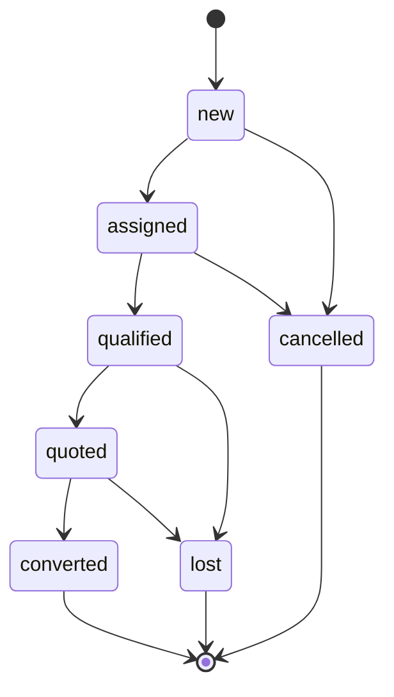

# تدقيق نضج وحدة Marketplace وخطة إكمالها

**الحالة:** مسودة تنفيذية بعد تدقيق النواة الأولية على فرع `feat/marketplace-publication-core`.

## 1. نتيجة التدقيق

النواة الحالية تنفذ جانباً مهماً لكنه محدود: تعريف التاجر، إسقاط المنتج العام، العرض، وصندوق أحداث موقّع لإرسال الإسقاط إلى الفهرس المركزي. هذه ليست بعدُ وحدة Marketplace ناضجة. ويجب عدم عرضها على أنها متجر مكتمل أو لوحة سوق إنتاجية قبل إكمال دورة الطلب والتحويل والتحليلات والتدقيق واستقبال الأحداث.

| المحور | الوضع الحالي | الفجوة | قرار الإكمال |
|---|---|---|---|
| نمذجة الكتالوج | تاجر، منشور منتج، عرض، صندوق أحداث | لا توجد دورة مراجعة كاملة أو تعليق/رفض منضبط | إضافة انتقالات حالة صريحة ومسوّغة وسجل تدقيق |
| الواجهة | صفحة واحدة بجداول ونماذج أولية | إدخال معرفات يدوياً، غياب تفاصيل ومرشحات وعدادات وتحويلات، استخدام تنسيقات مضمنة غير منسجمة | إعادة تركيبها إلى مساحة عمل بمكونات فرعية وبطاقات ومحددات ونوافذ من النظام الحالي |
| الطلبات | غير موجودة | لا يوجد استفسار زائر، سلة طلب، تعيين مسؤول، متابعة أو SLA | إضافة كيان طلب/استفسار وعناصره وتعيين المالك والحالات والتعليقات |
| التحويل التشغيلي | غير موجود | لا يوجد ربط بعرض سعر أو فاتورة أو بيع خدمة | تحويل منضبط إلى عرض سعر، ثم إلى بيع منتج أو خدمة عند قرار المستخدم |
| التحليلات | غير موجودة | لا يوجد قمع سوق أو أداء عروض أو جودة مزامنة | إضافة ملخص تحليلي ومقاييس يومية واردة من الخادم المركزي |
| التكامل الوارد | الإرسال فقط | لا يوجد webhook موثق وموقع لاستقبال طلبات العميل والإيصالات والأحداث | إضافة استقبال موقّع مع حماية إعادة التشغيل وإزالة التكرار |
| الأمان والتدقيق | توقيع إرسال وحجب حقول تكلفة أساسية | لا توجد سجلات قرارات أو توثيق الأحداث الواردة | إضافة سجل تدقيق ورفض replay وقاعدة أحداث واردة |
| الاختبارات | اختبارات أمان وحدات معزولة | لا توجد تغطية دورة الطلب والتحويل أو تكامل HTTP | إضافة اختبارات الوحدة والعقد وHTTP مع mock والخزانة عند توفر MySQL |

> **الحكم التصميمي:** يجب إعادة استخدام مكونات الواجهة والأنماط التشغيلية في Accore؛ لا تُقبل صفحة إدارة قائمة على إدخال UUID يدوي أو حاويات CSS حرة بديلاً عن اختيار سجلات، فلاتر، صفحات تفاصيل، ومؤشرات التحكم المعتمدة.

## 2. نطاق MVP الناضج

يبقى السطح العام في `accsystem_operational` سطح اكتشاف وعروض واستفسارات فقط. لا يضاف Checkout أو دفع أو حجز مخزون عام في هذه المرحلة. يستقبل Accore الطلبات المؤهلة بصفته مصدر الحقيقة، ثم يحولها المستخدم المصرح له إلى مسار ERP واضح.

| المسار | الناتج التشغيلي | قاعدة الحماية |
|---|---|---|
| استفسار منتج | عرض سعر مسودة مع بنود مرتبطة بالمنتجات | لا يخصص أو يخصم مخزوناً عند إنشاء الاستفسار |
| استفسار خدمة | عرض سعر مسودة، أو بيع خدمة فقط بعد اختيار نوع السداد والعميل | لا ينشأ قيد أو فاتورة تلقائياً من رسالة زائر |
| طلب متعدد البنود | عرض سعر واحد مع ربط استرجاعي بالطلب | لا يسمح بالتحويل مرتين لنفس الطلب والوجهة |
| قبول العرض داخل ERP | يبقى ضمن دورة عرض السعر الحالية | لا يفرض Marketplace حالة مالية على ERP |
| الدفع والفاتورة | في وحدتي Sales وService Sale فقط | لا تدار مفاتيح دفع أو بيانات بطاقات داخل Marketplace |

## 3. دورة حياة الطلب والتحويل

يُنشأ الطلب من خادم المنصة المركزي عبر حدث موقع `marketplace.inquiry.created`، أو يدوياً من لوحة Marketplace. كل بند يحمل مرجع منشور الكتالوج أو العرض ومراجع المنتج المحلية التي تحقق منها Accore وقت الاستقبال. لا يثق Accore بالسعر أو قابلية البيع الواردين من السطح العام؛ يعيد التحقق منهما عند التحويل.

التحويل إلى عرض سعر هو المسار الافتراضي. يخزّن سجل التحويل نوع الوجهة ومعرفها والفاعل والوقت، ويرتبط بكيان الطلب من دون تغيير مخطط الجداول المالية القائمة. يسمح مسار بيع الخدمة فقط بتحويل صريح بعد تحديد العميل ونوع السداد، ويستدعي خدمة بيع الخدمات القائمة حتى تبقى الضرائب والقيود والحسابات المدينة داخل منطقها التشغيلي المعتمد.

## 4. تجربة الإدارة المستهدفة

تتكون الواجهة من مساحة عمل واحدة منظمة، لا من صفحة CRUD عامة. الرأس يعرض الحالة التشغيلية والمؤشرات؛ ثم بطاقات مؤشرات قابلة للنقر، وشريط مرشحات موحد، وتبويبات أو مسارات فرعية لكل سياق؛ وتُفصل الجداول والحوارات والنماذج إلى مكونات قابلة للاختبار.

| القسم | الاستخدام | المكونات المعتمدة |
|---|---|---|
| النظرة العامة | حجم الطلبات، معدل التحويل، منشورات نشطة، تأخر المزامنة | `KPICardRow` أو `StatsCard`، `PageSubHeader` |
| الطلبات | قائمة، تخصيص مسؤول، ملاحظات، بنود، تحويل | `FilterSection`، `SearchableSelect`، `Table`، `Dialog`، `ConfirmDialog` |
| الكتالوج | تجار، منشورات، عروض، مراجعة، نشر، سحب | نماذج ذات قوائم اختيار ووسائط، لا إدخال معرفات يدوياً |
| التحليلات | القمع، أداء العرض، المصدر، زمن الاستجابة، جودة المزامنة | بطاقات ومخططات بسيطة قائمة على بيانات API منظمة |
| سلامة المزامنة | صندوق الأحداث، الإيصالات، الأخطاء، إعادة المحاولة | جدول تدقيق ومرشحات حالة، لا كشف أسرار التوقيع |

## 5. عقد التكامل الموسع

| الاتجاه | الحدث أو الواجهة | الغرض | ضمانات العقد |
|---|---|---|---|
| Accore إلى المركزي | `catalog.*`, `offer.*`, `merchant.*` | نشر إسقاطات الكتالوج والعروض | revision، مفتاح idempotency، توقيع HMAC، deny-list للحقول الداخلية |
| المركزي إلى Accore | `marketplace.inquiry.created` | إنشاء طلب/استفسار من الزائر | توقيع وتاريخ وnonce ومعرف حدث فريد ومحدد إعادة تشغيل |
| المركزي إلى Accore | `marketplace.metrics.daily` | مقاييس الظهور والنقر والاستفسار | يوم ومصدر وإسقاط محددان وupsert idempotent |
| المركزي إلى Accore | `marketplace.delivery.receipt` | إيصال أو فشل معالجة حدث صادر | event id وrevision وسبب مقنن |
| Accore إلى المركزي | `marketplace.inquiry.status_changed` | تحديث حالة الاستفسار على السطح العام عند الحاجة | لا تُرسل أي بيانات عميل حساسة أو ملاحظات داخلية |

## 6. معايير القبول

تعد الوحدة مكتملة في هذا الإصدار فقط عندما يمكن للموظف المصرح له إنشاء تاجر ومنشور وعرض ومراجعتهما ونشرهما وسحبهما؛ رؤية حالة المزامنة؛ استقبال استفسار موقع؛ تعيينه وتأهيله وتوثيق ملاحظاته؛ تحويله مرة واحدة إلى عرض سعر أو إلى مسار بيع خدمة صريح؛ رؤية مؤشرات القمع؛ والاحتفاظ بسجل تدقيق. كما يجب أن تمر واجهة الإدارة بفحص TypeScript والبناء، وأن تمر اختبارات الحماية والدورة عندما تتوافر بيئة MySQL للاختبارات الكاملة.

## 7. ما لا يدخل في الإصدار

لا يدخل في النطاق Checkout، بوابة الدفع، التخفيض المباشر للمخزون من الصفحة العامة، إدارة الشحن، تسوية العمولات، أو فرض إنشاء فاتورة من حدث زائر. تلك مراحل لاحقة تعتمد على موافقة تجارية ومحاسبية وتعاقدات منفصلة.
