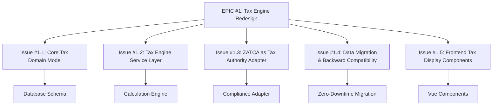

# GitHub EPIC: Tax Engine Transformation

## EPIC #1: [EPIC] Redesign Tax Architecture: From Static VAT to Multi-Jurisdiction Tax Engine

**Labels:** `epic`, `architecture`, `breaking-change`, `tax`, `refactor`  
**Milestone:** v3.0 - Tax Engine Modernization  
**Assignees:** @Emran025 (Lead), @backend-team  

---

### 1. The Current Reality (Why We Must Change)

Our accounting system currently treats tax as **static fields on transaction records**. This is not merely technical debt—it is an architectural constraint that prevents business growth.

**Current State:**
```
┌────────────────────────────────────────────┐
│  Transaction (Invoice/Purchase)            │
├────────────────────────────────────────────┤
│  subtotal        │ 1000.00                 │
│  vat_rate        │ 15.00    ◄── Hardcoded  │
│  vat_amount      │ 150.00   ◄── Calculated │
│  total           │ 1150.00                 │
└────────────────────────────────────────────┘
         │
         ▼
   Single tax rate per transaction
   No audit trail of calculation
   No support for mixed rates
   ZATCA logic tightly coupled
```

**Why This Is An Architectural Problem:**

| Constraint | Business Impact |
|------------|-----------------|
| Single `vat_rate` field | Cannot handle multiple tax types (VAT + Excise) |
| Calculation in models | Cannot adapt to regulatory changes without code deployment |
| No tax line items | Cannot provide detailed tax reporting for audits |
| ZATCA hardcoded | Cannot expand to other markets (UAE, Egypt, etc.) |
| Direct field storage | No history of tax rule changes |

**Real-World Scenario We Cannot Support:**
> A wholesale company sells to both Saudi and UAE customers. Saudi invoices need 15% VAT with ZATCA compliance. UAE invoices need 5% VAT with FTA compliance. Some products (tobacco) need additional 100% excise tax. Current system: **impossible**.

---

### 2. The Target Vision (What We Will Become)

We will transform tax from **data fields** into a **first-class domain entity** with clear boundaries and extension points.

**Target Architecture:**
```
┌─────────────────────────────────────────────────────────────┐
│                    TAX BOUNDED CONTEXT                      │
├─────────────────────────────────────────────────────────────┤
│                                                             │
│   ┌─────────────┐      ┌─────────────┐      ┌────────────┐  │
│   │   Tax       │◄────►│   Tax       │◄────►│  Tax       │  │
│   │   Authority │      │   Type      │      │  Rate      │  │
│   │  (ZATCA,    │      │  (VAT,      │      │ (15%, 5%,  │  │
│   │   FTA, etc) │      │   Excise)   │      │  Zero)     │  │
│   └─────────────┘      └─────────────┘      └────────────┘  │
│          │                                                  │
│          └──────────────────┬───────────────────────────────┘
│                             ▼
│                    ┌─────────────────┐
│                    │   Tax Engine    │
│                    │   (Calculator)  │
│                    │                 │
│                    │  • Rule Engine  │
│                    │  • Jurisdiction │
│                    │  • Exemptions   │
│                    └────────┬────────┘
│                             │
│                             ▼
│   Transaction ──────► ┌─────────────┐ ──────► Accounting
│   (Invoice)           │  Tax Lines  │         (GL Entries)
│                       │ (Audit Log) │
│                       └─────────────┘
│                             │
│                             ▼
│                    ┌─────────────────┐
│                    │  Compliance     │
│                    │  Adapters       │
│                    │  (ZATCA, FTA)   │
│                    └─────────────────┘
│
└─────────────────────────────────────────────────────────────┘
```

**Key Architectural Principles:**

1. **Authority Abstraction**: ZATCA becomes one implementation of `TaxAuthorityInterface`, not the system itself
2. **Calculation as Service**: Tax logic lives in domain services, not transaction models
3. **Immutable Tax Lines**: Every calculation leaves an audit trail
4. **Configuration Over Code**: New tax rules via database, not deployments
5. **Compliance as Plugin**: Regulatory adapters (ZATCA XML, QR codes) are swappable

---

### 3. Explicit Boundaries (What We Will NOT Touch Now)

To prevent scope creep, these are **explicitly out of scope** for this EPIC:

| Out of Scope | Reason | Future Consideration |
|--------------|--------|---------------------|
| **Multi-currency tax calculations** | Current system handles currency at transaction level; tax will inherit | Phase 2 if needed |
| **Real-time tax rate APIs** | Static rates with effective dates sufficient for now | Integration with tax rate services |
| **Advanced tax planning** | No tax optimization or scenario modeling | Separate "Tax Planning" module |
| **Payroll tax integration** | Payroll has separate tax logic | Unify in "Global Tax" EPIC |
| **Customs/duty calculations** | Import taxes require HS codes | Integration with customs modules |

---

### 4. Transformation Phases (How We Get There)

This EPIC will be delivered through **5 child issues**, each producing working software:



| Sub-Issue | Deliverable | Success Criteria |
|-----------|-------------|------------------|
| **#1.1** | `tax_authorities`, `tax_types`, `tax_rates`, `tax_lines` tables | Schema supports multi-authority, multi-rate with history |
| **#1.2** | `TaxCalculator` service, `TaxRuleEngine` | All tax calculations go through service; models are thin |
| **#1.3** | `ZATCATaxAuthority` implements `TaxAuthorityInterface` | ZATCA works as configured adapter, not hardcoded |
| **#1.4** | Migration script, feature flags | Production data migrated; rollback possible; zero downtime |
| **#1.5** | `TaxBreakdown` Vue component, Blade partials | UI shows multiple tax lines; authority-specific displays |

---

### 5. Definition of Done (When This EPIC Closes)

This EPIC closes when **all** of the following are true:

- [ ] Any tax authority can be added via configuration (database + config file)
- [ ] ZATCA continues to function exactly as before (no regression)
- [ ] A second tax authority (e.g., UAE FTA) can be added without code changes
- [ ] All existing invoices have migrated `tax_lines` records
- [ ] Old `vat_rate`/`vat_amount` fields are deprecated (not removed)
- [ ] Tax audit report shows calculation lineage per transaction line
- [ ] Frontend displays multiple taxes with authority attribution
- [ ] Documentation explains how to add new tax authority

---

### 6. Risks and Mitigations

| Risk | Impact | Mitigation |
|------|--------|------------|
| Migration data loss | Critical | Full backup + dry-run + verification queries |
| Performance regression | High | Benchmark before/after; caching layer |
| ZATCA compliance break | Critical | Parallel running; feature flags; sandbox testing |
| Developer confusion | Medium | Clear documentation; code review checklist |

---

### 7. References and Context

- **Current Schema:** See `database/migrations/2026_01_08_195344_create_zatca_einvoices_table.php`
- **Current Logic:** `app/Models/Invoice.php::calculateTotals()` method
- **ZATCA Specs:** [ZATCA e-Invoicing Technical Specifications](https://zatca.gov.sa)
- **Inspiration:** [Stripe Tax](https://stripe.com/tax), [Avalara](https://www.avalara.com) architecture patterns

---

### 8. Discussion Log

> This section will be updated as the EPIC progresses with key decisions and their rationale.

| Date | Decision | Rationale |
|------|----------|-----------|
| 2026-02-27 | EPIC created | Initial architectural review completed |
| | | |

---

**Next Action:** Create sub-issue #1.1 (Core Tax Domain Model) and assign to database team.

---

### 9. Implementation Status (2026-02-28)

Initial implementation of EPIC #1 has been delivered:

| Sub-Issue | Status | Deliverables |
|-----------|--------|--------------|
| **#1.1** | ✅ Done | `tax_authorities`, `tax_types`, `tax_rates`, `tax_lines` tables + models |
| **#1.2** | ✅ Done | `TaxCalculator` service, `TaxCalculationResult`, `TaxAuthorityInterface` |
| **#1.3** | ✅ Done | `ZATCATaxAuthority` implements `TaxAuthorityInterface` |
| **#1.4** | ✅ Done | `TaxSeeder`, migration to backfill existing invoices to `tax_lines`, feature flag `config('tax.use_tax_engine')` |
| **#1.5** | ✅ Done | `TaxBreakdown` React component, `InvoiceResource` includes `tax_lines`, AR ledger dialog shows tax breakdown |

**To enable the Tax Engine:** Set `TAX_ENGINE_ENABLED=true` in `.env`. When disabled, legacy `config('accounting.vat_rate')` is used. Old `vat_rate`/`vat_amount` fields remain for backward compatibility.

---

## Sub-Issue Template (for #1.1 - #1.5)

Each sub-issue should follow this format:

```
[Sub-Issue of #1] [AREA] Brief Description

**Parent EPIC:** #1
**Area:** Backend/Frontend/Database/Infrastructure
**Blocking:** [List what this blocks]
**Blocked By:** [List dependencies]

### Current State
[What exists now]

### Target State  
[What will exist after]

### Acceptance Criteria
- [ ] Specific, testable criteria
- [ ] ...

### Implementation Notes
[Any specific technical guidance, not mandates]
```
